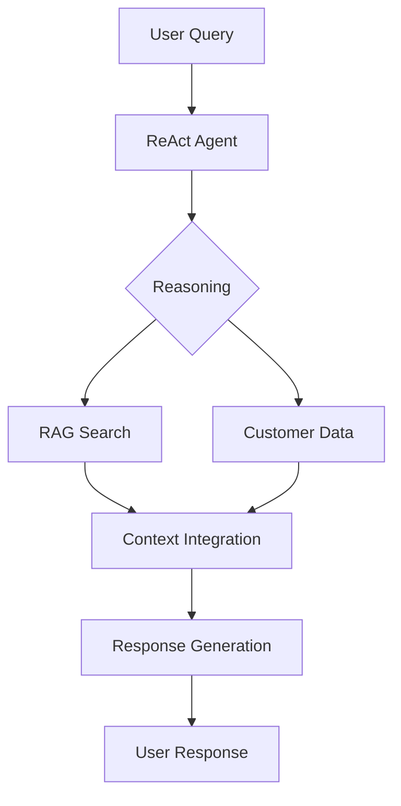

# Insurance Policy ReAct Agent with Hybrid RAG Pipeline

## Project Overview

This project implements a production-ready ReAct (Reasoning and Acting) Agent enhanced with a hybrid Retrieval Augmented Generation (RAG) pipeline for handling India First Life Insurance policy queries. The system combines the reasoning capabilities of Azure OpenAI's LLM with local Ollama embeddings and persistent vector storage for optimal performance and cost efficiency.

### 🚀 Key Features
- **Enhanced ReAct Architecture**: Implements the Reasoning and Acting framework with session management:
  - 🤔 **Reason**: Advanced query analysis with customer ID validation
  - 🎯 **Act**: Intelligent tool selection with error handling
  - 👀 **Observe**: Structured response processing with metadata tracking
  - 🔄 **Reflect**: Session-based learning with comprehensive logging

- **Hybrid RAG Pipeline**:
  - 📚 **Document Processing**: Multi-PDF ingestion with intelligent chunking
  - 🔍 **Semantic Search**: Chroma vector store with persistent storage
  - 💡 **Context Enhancement**: Hybrid embedding strategy (Azure OpenAI + Ollama)
  - 🎯 **Fallback Strategy**: Graceful degradation to basic policy information
  - ⚡ **Performance**: Request timeouts, retries, and connection validation

- **Production Features**:
  - 🔐 **Security**: Secure API key handling with validation
  - 📊 **Monitoring**: Comprehensive logging and session tracking
  - 🛡️ **Error Handling**: Graceful error recovery and user feedback
  - 📈 **Scalability**: Persistent vector storage and session management

### Architecture Diagram
```
User Query ──► ReAct Agent (Azure OpenAI gpt-4o)
                    │
                    ▼
            Enhanced Reasoning Phase
            (Query preprocessing, Customer ID validation)
                    │
        ┌───────────┴───────────┐
        ▼                       ▼
    Hybrid RAG Pipeline    Customer Data Tool
        │                       │
        ▼                       ▼
   Chroma Vector Store    JSON Database
   (Persistent Storage)         │
        │                       │
        ▼                       ▼
Azure OpenAI/Ollama ◄─── Tool Selection & Execution
   Embeddings                   │
        │                       │
        └─────────► Session Management & Logging
                            │
                            ▼
                Enhanced Response Generation
                    (Metadata + Error Handling)
                            │
                            ▼
                    Structured User Response
```

## Recent Enhancements (v2.0)

### 🔧 Technical Improvements
- **Vector Store Upgrade**: Migrated from InMemoryVectorStore to persistent Chroma
- **Error Handling**: Comprehensive error handling with graceful degradation
- **Session Management**: Stateful conversations with metadata tracking
- **Hybrid Embeddings**: Automatic fallback from Ollama to Azure OpenAI embeddings
- **Request Optimization**: Timeout handling, retries, and connection validation
- **Logging System**: Structured logging with file and console output

### 🛠️ Bug Fixes
- Fixed `create_react_agent` parameter issues (removed deprecated arguments)
- Resolved SecretStr validation with proper null checks
- Fixed RunnableConfig typing for proper agent configuration
- Updated embedding model initialization with fallback strategy

## System Architecture Overview

### 1. Core Components

#### 1.1 Conversational AI
- **Engine**: Azure OpenAI
- **Model**: gpt-4o
- **Endpoint**: https://wwqc-aus.openai.azure.com/
- **Configuration**: Located in `.env` and `config/settings.py`

#### 1.2 Hybrid RAG Pipeline with Persistent Storage
- **Primary Embedding Engine**: Ollama (Local) with automatic health checks
- **Fallback Embedding Engine**: Azure OpenAI (text-embedding-3-small)
- **Model**: nomic-embed-text (Ollama) / text-embedding-3-small (Azure)
- **Vector Store**: Chroma with persistent storage in `./vector_store`
- **Document Processing**: PyPDF Loader with optimized RecursiveCharacterTextSplitter
- **Health Monitoring**: Automatic Ollama connection validation and fallback

#### 1.3 Enhanced Tools and Session Management
- **Policy Documentation Tool**: Chroma-based vector search with fallback
- **Customer Data Tool**: Secure JSON-based customer information lookup
- **Session Management**: Stateful conversation tracking with metadata
- **Error Recovery**: Graceful error handling with user-friendly messages
- **Logging System**: Comprehensive logging to file and console

### 2. File Structure

```
testbot/
├── acs_agents/
│   ├── __init__.py
│   ├── react_agent.py     # Enhanced ReAct agent with session management
│   └── tools.py           # Hybrid RAG pipeline with Chroma vector store
├── config/
│   ├── __init__.py
│   └── settings.py        # Enhanced configuration with validation
├── data/
│   ├── customers.json     # Customer database (updated path)
│   └── policy_docs/*.pdf  # Insurance policy documents
├── docs/
│   └── technical_documentation.md
├── vector_store/          # Persistent Chroma vector storage
├── main.py               # Application entry point
├── test_agent.py         # Agent testing script
├── requirements.txt      # Updated dependencies
├── insurance_agent.log   # Application logs
├── .env                 # Environment configuration
└── README.md            # Project documentation
```

### 3. Configuration Management

#### 3.1 Environment Variables (`.env`)
```ini
# Azure OpenAI Configuration
AZURE_OPENAI_API_KEY=<your-key>
AZURE_OPENAI_ENDPOINT=https://wwqc-aus.openai.azure.com/
AZURE_OPENAI_API_VERSION=2024-10-01-preview
MODEL_NAME=gpt-4o

# Ollama Configuration (with health checks)
OLLAMA_BASE_URL=http://localhost:11434
OLLAMA_EMBEDDING_MODEL=nomic-embed-text
USE_OLLAMA_FOR_RAG=true

# RAG Pipeline Settings
CHUNK_SIZE=512
CHUNK_OVERLAP=50
POLICY_DOC_PATH=data/policy_docs/sample_policy.pdf
CUSTOMER_DATA_PATH=data/customers.json
```

#### 3.2 Enhanced Settings Management (`settings.py`)
- Automatic environment variable validation
- Configuration parameter type checking
- Path validation for data files
- Azure OpenAI credential verification
- Ollama health check integration

### 4. Core Components Details

#### 4.1 Enhanced ReAct Agent Architecture (`react_agent.py`)
The ReAct framework now includes production-ready features:

##### 4.1.1 Enhanced Reasoning Phase
```python
class SessionState:
    def __init__(self):
        self.start_time = time.time()
        self.tool_usage = {"policy_docs_qna_tool": 0, "customer_data_tool": 0}
        self.error_count = 0

def preprocess_query(query: str) -> str:
    """Enhanced query preprocessing with validation"""
    return query.strip()

def validate_customer_id(query: str) -> bool:
    """Customer ID format validation"""
    return "CUST" in query.upper() and any(c.isdigit() for c in query)
```

##### 4.1.2 Production-Ready Acting Phase
```python
def insurance_react_agent(state: Input) -> Output:
    """Enhanced insurance ReAct agent with monitoring"""
    try:
        session_state = get_session_state(session_id)
        
        # Enhanced configuration with timeout and retries
        config = RunnableConfig(configurable={
            "thread_id": session_id,
            "timeout": 30,
            "max_retries": 3
        })
        
        # Execute with comprehensive error handling
        ai_msg = react_agent.invoke(
            input={"messages": [{"role": "user", "content": query}]},
            config=config
        )
        
        return create_structured_response(ai_msg, session_state)
    except Exception as e:
        return handle_error_gracefully(e, session_state)
```

##### 4.1.3 Enhanced System Message
The agent now includes detailed instructions for:
- Professional insurance domain responses
- Customer ID validation and security
- Tool usage guidelines with examples
- Error handling and compliance
- Response length limitations (max 50 words)

#### 4.2 Hybrid RAG Pipeline Architecture (`tools.py`)
The RAG pipeline now features hybrid embedding strategy and persistent storage:

##### 4.2.1 Health Check and Fallback Strategy
```python
def check_ollama_connection() -> bool:
    """Check if Ollama is running and accessible"""
    try:
        response = requests.get(f"{Settings.OLLAMA_BASE_URL}/api/tags", timeout=5)
        return response.status_code == 200
    except Exception:
        return False

def create_vector_store(pdf_paths: Union[str, List[str]]) -> Chroma:
    """Create persistent vector store with hybrid embeddings"""
    if Settings.USE_OLLAMA_FOR_RAG and check_ollama_connection():
        embeddings = OllamaEmbeddings(
            model=Settings.OLLAMA_EMBEDDING_MODEL,
            base_url=Settings.OLLAMA_BASE_URL
        )
    else:
        # Fallback to Azure embeddings
        embeddings = AzureOpenAIEmbeddings(
            azure_deployment="text-embedding-3-small",
            azure_endpoint=endpoint,
            api_key=SecretStr(api_key if api_key else ""),
            api_version=api_version
        )
```

##### 4.2.2 Persistent Vector Storage
```python
    # Create persistent Chroma vector store
    vector_store = Chroma.from_documents(
        documents=chunks,
        embedding=embeddings,
        persist_directory="./vector_store"  # Persistent storage
    )
```

##### 4.2.3 Enhanced Document Processing
- Multi-PDF support with error handling
- Optimized chunking strategy (512 tokens, 50 overlap)
- Progress tracking and logging
- Memory-efficient processing

##### 4.2.4 Intelligent Search with Fallback
```python
@tool
def policy_docs_qna_tool(query: str) -> str:
    """Enhanced policy search with fallback"""
    try:
        if vector_store is not None:
            docs = vector_store.similarity_search(query, k=3)
            if docs:
                context = "\n\n".join(doc.page_content for doc in docs)
                return f"Based on India First Life Insurance documentation:\n\n{context}"
        
        # Intelligent fallback to basic policy information
        return provide_basic_policy_info(query)
    except Exception as e:
        return handle_search_error(e)
```

#### 4.3 Integration Flow


### 5. Tools and Features

#### 5.1 Policy Documentation Tool
- Vector similarity search in policy documents
- Fallback to basic policy information
- Context-aware response generation

#### 5.2 Customer Data Tool
- JSON-based customer information retrieval
- Secure handling of sensitive data
- Policy and personal information lookup

### 6. Updated Dependencies

```plaintext
# Core Framework
langchain==0.3.27
langchain-openai==0.3.30
langchain-community==0.3.27
langchain-core==0.3.74
langgraph==0.6.6

# Vector Store & Embeddings
chromadb>=0.4.0
langchain-ollama

# Configuration & Utilities
python-dotenv==1.1.1
pydantic==2.11.7
requests
PyPDF2

# Optional: Development & Testing
pytest
black
isort
```

### 7. Enhanced Setup and Deployment

#### 7.1 Prerequisites
- Python 3.9+ (3.13+ recommended for latest features)
- Ollama installed and running locally
- Azure OpenAI API access with gpt-4o deployment
- India First Life Insurance policy documents (PDF format)
- Customer data in JSON format

#### 7.2 Installation Steps
1. **Clone and Setup**:
   ```bash
   git clone https://github.com/shaktiaryan/InsuranceDocRAG.git
   cd InsuranceDocRAG
   python -m venv .venv
   .venv\Scripts\activate  # Windows
   pip install -r requirements.txt
   ```

2. **Configuration**:
   - Copy `.env.example` to `.env`
   - Configure Azure OpenAI credentials
   - Set up Ollama with nomic-embed-text model
   - Place PDF documents in `data/policy_docs/`
   - Configure customer data in `data/customers.json`

3. **Initialize Services**:
   ```bash
   # Start Ollama service
   ollama serve
   
   # Pull embedding model
   ollama pull nomic-embed-text
   
   # Test the agent
   python test_agent.py
   ```

4. **Run Application**:
   ```bash
   python main.py
   ```

### 8. Comprehensive Error Handling

#### 8.1 RAG Pipeline Error Management
- **PDF Loading**: Graceful handling of corrupted or missing documents
- **Embedding Generation**: Automatic fallback from Ollama to Azure OpenAI
- **Vector Store**: Fallback to basic policy information when vector search fails
- **Connection Issues**: Health checks with retry mechanisms
- **Memory Management**: Optimized chunking to prevent memory overflow

#### 8.2 Agent Error Recovery
- **API Timeouts**: 30-second timeout with 3 retry attempts
- **Model Context**: Intelligent context window management
- **Invalid Queries**: Customer ID validation and format checking
- **Session Management**: Stateful error tracking and recovery
- **Graceful Degradation**: User-friendly error messages without technical details

#### 8.3 Logging and Monitoring
```python
# Structured logging configuration
logging.basicConfig(
    level=logging.INFO,
    format='%(asctime)s - %(name)s - %(levelname)s - %(message)s',
    handlers=[
        logging.FileHandler('insurance_agent.log'),
        logging.StreamHandler()
    ]
)

# Session metadata tracking
class Metadata(BaseModel):
    timestamp: str
    session_duration: float
    tool_usage: Dict[str, int]
    error_count: int
```

### 9. Performance Optimization

#### 9.1 Vector Store Performance
- **Persistent Storage**: Chroma vector store with disk persistence
- **Chunk Strategy**: Optimized 512 tokens with 50-token overlap
- **Search Optimization**: Top-3 similarity search with relevance scoring
- **Memory Efficiency**: Lazy loading and garbage collection
- **Batch Processing**: Multiple PDF documents processed efficiently

#### 9.2 Agent Performance
- **Request Optimization**: 30-second timeouts with exponential backoff
- **Session Management**: In-memory session state with cleanup
- **Connection Pooling**: Reusable HTTP connections for API calls
- **Caching Strategy**: Vector embeddings cached on disk
- **Parallel Processing**: Concurrent tool execution where possible

#### 9.3 Monitoring Metrics
- Session duration tracking
- Tool usage statistics
- Error rate monitoring
- Response time measurement
- Memory usage tracking

### 10. Security and Compliance

#### 10.1 API Security
- **Secure Credential Management**: SecretStr with null validation
- **Environment Protection**: Credentials stored in .env files only
- **Rate Limiting**: Built-in Azure OpenAI rate limit compliance
- **Request Timeout**: 30-second timeouts to prevent hanging connections
- **Error Sanitization**: No sensitive data exposed in error messages

#### 10.2 Data Privacy and Protection
- **Customer Data**: JSON-based storage with access control
- **Query Validation**: Customer ID format verification (CUSTXXX)
- **Response Filtering**: Sensitive information masking
- **Session Isolation**: Individual session state management
- **Audit Trail**: Comprehensive logging without sensitive data

#### 10.3 Insurance Domain Compliance
- **Professional Boundaries**: Strict insurance domain focus
- **No Financial Advice**: Clear disclaimers and limitations
- **Regulatory Compliance**: Data protection guidelines adherence
- **Error Transparency**: Clear error explanations without technical details

### 11. Testing and Quality Assurance

#### 11.1 Unit Testing
```python
# Example test structure
def test_agent_initialization():
    """Test agent initialization with proper configuration"""
    assert react_agent is not None
    assert vector_store is not None

def test_customer_id_validation():
    """Test customer ID format validation"""
    assert validate_customer_id("CUST001") == True
    assert validate_customer_id("invalid") == False

def test_error_handling():
    """Test graceful error handling"""
    result = insurance_react_agent({
        "session_id": "test",
        "query": "invalid query"
    })
    assert "error_count" in result["metadata"]
```

#### 11.2 Integration Testing
- Azure OpenAI connectivity tests
- Ollama service availability tests
- Vector store persistence tests
- PDF document loading tests
- Customer data retrieval tests

#### 11.3 Performance Testing
- Response time benchmarks
- Memory usage profiling
- Concurrent session handling
- Large document processing
- Error recovery timing

### 12. Production Deployment Guide

#### 12.1 Environment Setup
```bash
# Production environment configuration
export AZURE_OPENAI_API_KEY="your-production-key"
export AZURE_OPENAI_ENDPOINT="https://your-endpoint.openai.azure.com/"
export OLLAMA_BASE_URL="http://ollama-service:11434"
export USE_OLLAMA_FOR_RAG=true
```

#### 12.2 Docker Deployment
```dockerfile
FROM python:3.11-slim

WORKDIR /app
COPY requirements.txt .
RUN pip install -r requirements.txt

COPY . .
RUN mkdir -p vector_store logs

EXPOSE 8000
CMD ["python", "main.py"]
```

#### 12.3 Kubernetes Deployment
```yaml
apiVersion: apps/v1
kind: Deployment
metadata:
  name: insurance-rag-agent
spec:
  replicas: 3
  selector:
    matchLabels:
      app: insurance-rag
  template:
    spec:
      containers:
      - name: rag-agent
        image: insurance-rag:latest
        env:
        - name: AZURE_OPENAI_API_KEY
          valueFrom:
            secretKeyRef:
              name: azure-credentials
              key: api-key
```

#### 12.4 Health Checks and Monitoring
- Liveness probes for container health
- Readiness probes for service availability
- Prometheus metrics for monitoring
- Grafana dashboards for visualization
- AlertManager for error notifications

### 13. Future Enhancements and Roadmap

#### 13.1 Short-term Improvements (Q1 2025)
- **Advanced Vector Search**: Implement metadata filtering and semantic ranking
- **Multi-language Support**: Add Hindi and regional language support for policies
- **Voice Interface**: Integration with speech-to-text for voice queries
- **Mobile App**: React Native mobile application for customer queries
- **Real-time Updates**: WebSocket support for real-time policy updates

#### 13.2 Medium-term Enhancements (Q2-Q3 2025)
- **Advanced Analytics**: Customer query analysis and insights dashboard
- **Personalization**: User preference learning and personalized responses
- **Integration APIs**: REST APIs for external system integration
- **Advanced Security**: OAuth2, JWT tokens, and role-based access control
- **Compliance Dashboard**: Regulatory compliance monitoring and reporting

#### 13.3 Long-term Vision (Q4 2025 and beyond)
- **AI-Powered Claims**: Automated claim processing with document analysis
- **Predictive Analytics**: Customer behavior prediction and recommendations
- **Blockchain Integration**: Secure policy verification using blockchain
- **IoT Integration**: Smart device data for risk assessment
- **Federated Learning**: Privacy-preserving model improvements

## Appendix

### A. Technical Implementation Details

#### A.1 ReAct Agent Configuration
```python
# Enhanced agent initialization with comprehensive error handling
try:
    validate_azure_config()
    llm = AzureChatOpenAI(
        azure_deployment=model_name,
        azure_endpoint=endpoint,
        api_key=SecretStr(api_key if api_key else ""),
        api_version=api_version,
        temperature=0.7,
        model_kwargs={"request_timeout": 30},
        max_retries=3
    )
    
    react_agent = create_react_agent(
        llm,
        tool_functions,
        checkpointer=checkpointer,
        prompt=system_message  # Enhanced prompt with domain expertise
    )
except Exception as e:
    logger.error(f"Failed to initialize agent: {str(e)}")
    raise
```

#### A.2 Hybrid Embedding Strategy
```python
def get_embedding_model():
    """Smart embedding model selection with fallback"""
    if Settings.USE_OLLAMA_FOR_RAG and check_ollama_connection():
        return OllamaEmbeddings(
            model=Settings.OLLAMA_EMBEDDING_MODEL,
            base_url=Settings.OLLAMA_BASE_URL
        )
    else:
        return AzureOpenAIEmbeddings(
            azure_deployment="text-embedding-3-small",
            azure_endpoint=Settings.AZURE_OPENAI_ENDPOINT,
            api_key=SecretStr(Settings.AZURE_OPENAI_API_KEY or ""),
            api_version=Settings.AZURE_OPENAI_API_VERSION
        )
```

#### A.3 Session Management Implementation
```python
class SessionState:
    """Enhanced session state with comprehensive tracking"""
    def __init__(self):
        self.start_time = time.time()
        self.tool_usage = {"policy_docs_qna_tool": 0, "customer_data_tool": 0}
        self.error_count = 0
        self.query_history = []
        self.response_times = []

def create_session_metadata(session_state: SessionState) -> Dict[str, Any]:
    """Create detailed session metadata for monitoring"""
    return {
        "timestamp": datetime.now().isoformat(),
        "session_duration": time.time() - session_state.start_time,
        "tool_usage": session_state.tool_usage,
        "error_count": session_state.error_count,
        "avg_response_time": sum(session_state.response_times) / len(session_state.response_times) if session_state.response_times else 0
    }
```

### B. Troubleshooting Guide

#### B.1 Common Issues and Solutions

| Issue | Symptoms | Solution |
|-------|----------|----------|
| **Ollama Connection Failed** | RAG pipeline falls back to Azure | Check `ollama serve` status, verify base URL |
| **Vector Store Creation Error** | No vector search available | Verify PDF paths, check disk space, restart service |
| **Azure OpenAI Timeout** | Agent responses delayed/failed | Check API key, endpoint, increase timeout values |
| **Customer ID Validation** | Customer data not found | Verify CUSTXXX format, check customers.json |
| **Memory Issues** | System slowdown | Reduce chunk size, implement garbage collection |

#### B.2 Debug Commands
```bash
# Check Ollama status
curl http://localhost:11434/api/tags

# Test Azure OpenAI connection
python -c "from config.settings import Settings; print(Settings.AZURE_OPENAI_ENDPOINT)"

# Verify vector store
python -c "from acs_agents.tools import vector_store; print(vector_store)"

# Test agent import
python -c "from acs_agents.react_agent import insurance_react_agent; print('Success')"
```

### C. API Reference

#### C.1 Agent Function Signature
```python
def insurance_react_agent(state: Input) -> Output:
    """
    Enhanced insurance ReAct agent with monitoring
    
    Args:
        state: Input containing session_id and query
        
    Returns:
        Output with response and metadata
        
    Raises:
        ValueError: Invalid input format
        ConnectionError: Service unavailable
    """
```

#### C.2 Tool Function Signatures
```python
@tool
def policy_docs_qna_tool(query: str) -> str:
    """Search India First Life Insurance policy documentation"""

@tool  
def customer_data_tool(customer_id: str) -> dict:
    """Retrieve customer policy details and information"""
```

### D. Configuration Reference

#### D.1 Complete Environment Variables
```ini
# Azure OpenAI (Required)
AZURE_OPENAI_API_KEY=your_api_key_here
AZURE_OPENAI_ENDPOINT=https://your-endpoint.openai.azure.com/
AZURE_OPENAI_API_VERSION=2024-10-01-preview
MODEL_NAME=gpt-4o

# Ollama (Optional - falls back to Azure)
OLLAMA_BASE_URL=http://localhost:11434
OLLAMA_EMBEDDING_MODEL=nomic-embed-text
USE_OLLAMA_FOR_RAG=true

# RAG Configuration
CHUNK_SIZE=512
CHUNK_OVERLAP=50
POLICY_DOC_PATH=data/policy_docs/sample_policy.pdf
CUSTOMER_DATA_PATH=data/customers.json

# Logging
LOG_LEVEL=INFO
LOG_FILE=insurance_agent.log
```

#### D.2 Customer Data Format
```json
{
  "CUST001": {
    "name": "John Doe",
    "policy_number": "POL123456",
    "policy_type": "Term Life",
    "premium": 5000,
    "coverage": 1000000,
    "status": "Active"
  }
}
```

---

*Last Updated: November 1, 2025*
*Version: 2.0.0*
*Author: Insurance RAG Team*
*Repository: https://github.com/shaktiaryan/InsuranceDocRAG*