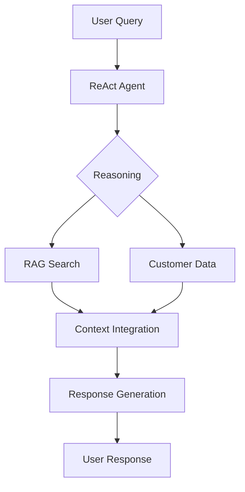

# Insurance Policy ReAct Agent with RAG Pipeline

## Project Overview

This project implements a sophisticated ReAct (Actor-Critic) Agent enhanced with a Retrieval Augmented Generation (RAG) pipeline for handling insurance policy queries. The system combines the reasoning capabilities of a Large Language Model (LLM) with the precision of retrieved context from insurance documentation.

### Key Features
- **ReAct Architecture**: Implements the Reasoning and Acting framework, allowing the agent to:
  - 🤔 **Reason**: Analyze user queries and decompose complex questions
  - 🎯 **Act**: Choose and execute appropriate tools based on reasoning
  - 👀 **Observe**: Process tool outputs and refine responses
  - 🔄 **Reflect**: Learn from interactions to improve response quality

- **RAG Pipeline Integration**:
  - 📚 Document Ingestion: Processes insurance policy PDFs
  - 🔍 Semantic Search: Uses Ollama's local embeddings
  - 💡 Context Enhancement: Augments LLM responses with relevant policy information
  - 🎯 Precision Boost: Reduces hallucination through grounded responses

### Architecture Diagram
```
User Query ──► ReAct Agent (Azure OpenAI)
                    │
                    ▼
            Reasoning Phase
                    │
        ┌───────────┴───────────┐
        ▼                       ▼
    RAG Pipeline          Customer Data
        │                       │
        ▼                       ▼
   Local Ollama          JSON Database
   Embeddings                   │
        │                       │
        ▼                       ▼
Vector Search ◄─────── Tool Selection
        │                       │
        └─────────►  Response Generation
                            │
                            ▼
                    User Response
```

## System Architecture Overview

### 1. Core Components

#### 1.1 Conversational AI
- **Engine**: Azure OpenAI
- **Model**: gpt-4o
- **Endpoint**: https://wwqc-aus.openai.azure.com/
- **Configuration**: Located in `.env` and `config/settings.py`

#### 1.2 RAG (Retrieval Augmented Generation) Pipeline
- **Embedding Engine**: Ollama (Local)
- **Model**: nomic-embed-text
- **Vector Store**: InMemoryVectorStore
- **Document Processing**: PyPDF Loader with RecursiveCharacterTextSplitter

#### 1.3 Tools and Utilities
- **Policy Documentation Tool**: Vector search-based document retrieval
- **Customer Data Tool**: JSON-based customer information lookup
- **System Message Handler**: Managed by LangGraph React Agent

### 2. File Structure

```
testbot/
├── acs_agents/
│   ├── __init__.py
│   ├── react_agent.py     # Main conversation handler
│   └── tools.py           # RAG and utility tools
├── config/
│   ├── __init__.py
│   └── settings.py        # Configuration management
├── data/
│   ├── customer_data.json
│   └── policy_docs/*.pdf
├── docs/
│   └── technical_documentation.md
├── main.py               # Application entry point
├── requirements.txt      # Dependencies
└── .env                 # Environment configuration
```

### 3. Configuration Management

#### 3.1 Environment Variables (`.env`)
```ini
# Azure OpenAI Configuration
AZURE_OPENAI_API_KEY=<your-key>
AZURE_OPENAI_ENDPOINT=https://wwqc-aus.openai.azure.com/
AZURE_OPENAI_API_VERSION=2024-10-01-preview
MODEL_NAME=gpt-4o

# Ollama Configuration
OLLAMA_BASE_URL=http://localhost:11434
OLLAMA_EMBEDDING_MODEL=nomic-embed-text
CHUNK_SIZE=512
CHUNK_OVERLAP=50
```

#### 3.2 Settings Management (`settings.py`)
- Environment variable loading
- Configuration parameter management
- Path configurations for data files

### 4. Core Components Details

#### 4.1 ReAct Agent Architecture
The ReAct (Reasoning and Acting) framework implements a sophisticated decision-making process:

##### 4.1.1 Reasoning Phase
```python
class ReActAgent:
    def reason(self, query: str) -> Thought:
        # 1. Analyze query intent
        # 2. Decompose complex questions
        # 3. Plan action sequence
        # 4. Identify required tools
```

##### 4.1.2 Acting Phase
```python
    def act(self, thought: Thought) -> Action:
        # 1. Tool selection based on reasoning
        # 2. Parameter preparation
        # 3. Tool execution
        # 4. Result capture
```

##### 4.1.3 Observation Phase
```python
    def observe(self, action_result: Any) -> Observation:
        # 1. Process tool output
        # 2. Extract relevant information
        # 3. Update agent state
        # 4. Prepare for next action
```

##### 4.1.4 Reflection Phase
```python
    def reflect(self, observation: Observation) -> NextStep:
        # 1. Evaluate action success
        # 2. Update strategy if needed
        # 3. Decide on next action
        # 4. Learn from interaction
```

#### 4.2 RAG Pipeline Architecture (`tools.py`)
The RAG pipeline enhances the agent's responses with relevant context:

##### 4.2.1 Document Processing
```python
def process_documents():
    # 1. Load PDF documents
    # 2. Extract text content
    # 3. Clean and normalize text
    # 4. Prepare for chunking
```

##### 4.2.2 Chunking Strategy
```python
def create_chunks():
    # 1. Split documents (512 tokens)
    # 2. Maintain overlap (50 tokens)
    # 3. Preserve semantic meaning
    # 4. Handle special formatting
```

##### 4.2.3 Embedding Generation
```python
def generate_embeddings():
    # 1. Initialize Ollama
    # 2. Process text chunks
    # 3. Generate embeddings
    # 4. Optimize for memory
```

##### 4.2.4 Vector Store Management
```python
def manage_vector_store():
    # 1. Initialize store
    # 2. Index embeddings
    # 3. Enable efficient search
    # 4. Handle updates
```

#### 4.3 Integration Flow


### 5. Tools and Features

#### 5.1 Policy Documentation Tool
- Vector similarity search in policy documents
- Fallback to basic policy information
- Context-aware response generation

#### 5.2 Customer Data Tool
- JSON-based customer information retrieval
- Secure handling of sensitive data
- Policy and personal information lookup

### 6. Dependencies

```plaintext
langchain==0.3.27
langchain-openai==0.3.30
langchain-community==0.3.27
langchain-core==0.3.74
langgraph==0.6.6
python-dotenv==1.1.1
pydantic==2.11.7
langchain-ollama
requests
```

### 7. Setup and Deployment

#### 7.1 Prerequisites
- Python 3.8+
- Ollama installed and running
- Azure OpenAI API access
- PDF policy documents
- Customer data JSON

#### 7.2 Installation Steps
1. Clone repository
2. Install dependencies: `pip install -r requirements.txt`
3. Configure `.env` file
4. Start Ollama service
5. Run: `python main.py`

### 8. Error Handling

#### 8.1 RAG Pipeline
- PDF loading failures
- Embedding generation errors
- Vector store creation issues
- Ollama connection problems

#### 8.2 Conversation Handler
- API timeouts
- Model context limitations
- Invalid customer IDs
- Missing policy information

### 9. Performance Considerations

#### 9.1 Document Processing
- Chunk size: 512 tokens
- Chunk overlap: 50 tokens
- Multiple PDF support
- Parallel document loading

#### 9.2 Vector Search
- Top-k retrieval (k=3)
- Similarity threshold
- Context window management

### 10. Security Considerations

#### 10.1 API Security
- Secure API key handling
- Environment variable protection
- Rate limiting compliance

#### 10.2 Data Privacy
- Customer data protection
- Policy information access control
- Secure response handling

### 11. Monitoring and Logging

#### 11.1 System Logs
- RAG pipeline status
- Document loading progress
- Vector store creation
- Tool execution status

#### 11.2 Error Tracking
- API failures
- Document processing errors
- Customer data access issues
- Model execution problems

### 12. Future Enhancements

#### 12.1 ReAct Agent Improvements
- **Enhanced Reasoning**:
  - Multi-step reasoning chains
  - Uncertainty handling
  - Complex query decomposition
  - Meta-learning capabilities

- **Action Optimization**:
  - Dynamic tool selection
  - Parallel tool execution
  - Action prioritization
  - Error recovery strategies

- **Observation Enhancement**:
  - Context retention
  - Historical learning
  - Pattern recognition
  - Feedback incorporation

#### 12.2 RAG Pipeline Enhancements
- **Document Processing**:
  - Incremental updates
  - Real-time document indexing
  - Automated metadata extraction
  - Multi-format support

- **Embedding Optimization**:
  - Hybrid embedding models
  - Dynamic chunk sizing
  - Semantic clustering
  - Memory optimization

- **Search Improvements**:
  - Semantic filtering
  - Multi-hop retrieval
  - Cross-document reasoning
  - Context ranking

#### 12.3 System Architecture
- **Scalability**:
  - Distributed RAG pipeline
  - Load balancing
  - Horizontal scaling
  - Cache optimization

- **Integration**:
  - API ecosystem
  - Event streaming
  - Microservices architecture
  - Cloud deployment

#### 12.4 User Experience
- **Interaction**:
  - Multi-modal input
  - Interactive clarification
  - Visual policy exploration
  - Personalized responses

- **Features**:
  - Policy comparison
  - Premium calculation
  - Claim status tracking
  - Document generation

## Appendix

### A. Technical Deep Dive

#### ReAct Agent Implementation
1. **Reasoning Module**
   ```python
   class ReActReasoning:
       def analyze_intent(query: str) -> Intent:
           # Intent classification
           # Query decomposition
           # Context analysis
           return classified_intent

       def plan_actions(intent: Intent) -> ActionPlan:
           # Action sequence planning
           # Tool selection strategy
           # Fallback planning
           return action_plan
   ```

2. **Action Execution**
   ```python
   class ReActExecution:
       def execute_plan(plan: ActionPlan) -> Results:
           # Sequential execution
           # Error handling
           # Result aggregation
           return execution_results
   ```

3. **Observation Processing**
   ```python
   class ReActObservation:
       def process_results(results: Results) -> Insights:
           # Result analysis
           # Pattern detection
           # State updating
           return processed_insights
   ```

#### RAG Pipeline Components
1. **Document Processor**
   ```python
   class DocumentProcessor:
       def process(document: PDF) -> ProcessedDoc:
           # Content extraction
           # Structure analysis
           # Metadata generation
           return processed_document
   ```

2. **Embedding Generator**
   ```python
   class EmbeddingGenerator:
       def generate(text: str) -> Embedding:
           # Chunking
           # Embedding generation
           # Optimization
           return embeddings
   ```

3. **Vector Store Manager**
   ```python
   class VectorStoreManager:
       def store(embeddings: List[Embedding]) -> bool:
           # Indexing
           # Storage optimization
           # Search preparation
           return success_status
   ```

### B. Troubleshooting Guide

#### Common Issues and Solutions
1. **Ollama Connection Issues**
   - Check Ollama service status
   - Verify base URL configuration
   - Ensure model is downloaded

2. **Vector Store Creation Failures**
   - Verify chunk size settings
   - Check PDF document format
   - Monitor memory usage

3. **Azure OpenAI Integration**
   - Validate API key
   - Check endpoint configuration
   - Verify model deployment

### B. API Reference

#### Azure OpenAI
- Model: gpt-4o
- API Version: 2024-10-01-preview
- Deployment region: Australia

#### Ollama
- Base URL: http://localhost:11434
- Embedding model: nomic-embed-text
- Context window: 512 tokens

### C. Configuration Reference

#### Environment Variables
Complete list of supported configuration options and their default values.

#### Settings Module
Detailed explanation of all configuration parameters and their usage.

---

*Last Updated: November 1, 2025*
*Version: 1.0.0*